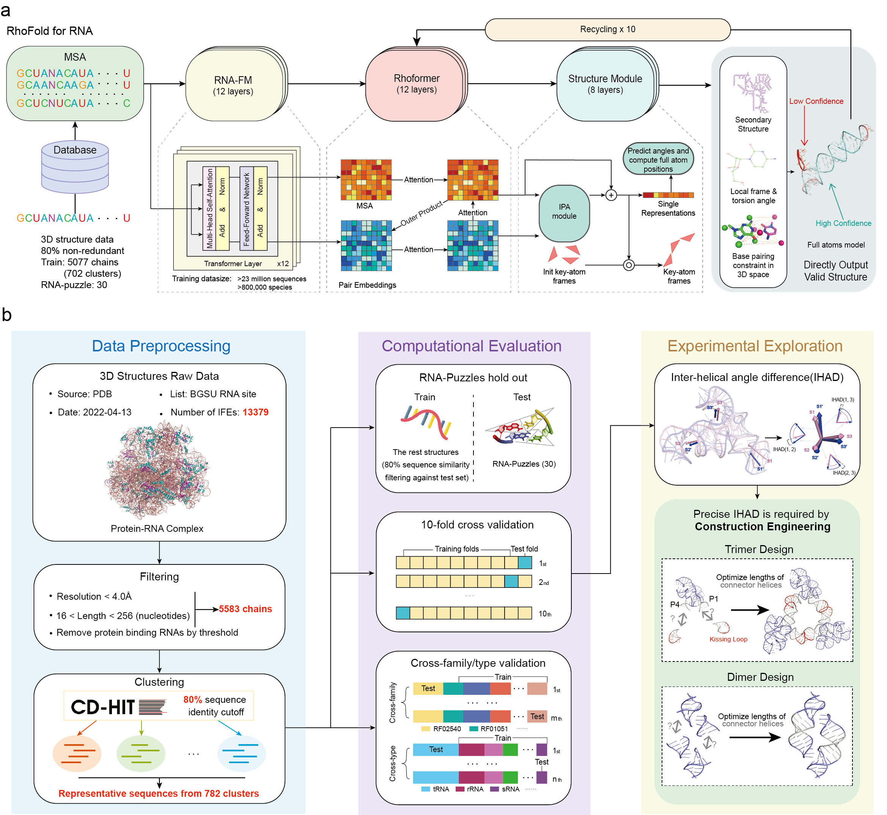

# RhoFold: Fast and Accurate RNA 3D Structure Prediction with Deep Learning



This is the opensource code for RhoFold.

## Updates

***10/10/2022***

Initial commits:
1.  [Pretrained model](https://drive.google.com/file/d/1To2bjbhQLFx1k8hBOW5q1JFq6ut27XEv/view?usp=sharing) is provided.

## Installation <a name="Setup_Environment"></a>

Create Environment with Conda
First, download the repository and create the environment.

### Linux Users
```
git clone https://github.com/RFOLD/RhoFold.git 
cd ./RhoFold
conda env create -f ./envs/environment_linux.yml
```

### MacOS Users
```
git clone https://github.com/RFOLD/RhoFold.git 
cd ./RhoFold
conda env create -f ./envs/environment_macos.yml 
```

Then, activate the "rhofold" environment.
```
conda activate rhofold
python setup.py install
```

### Download pretrained model

```
cd ./pretrained
wget https://proj.cse.cuhk.edu.hk/aihlab/rhofold/api/download?filename=rhofold_pretrained.pt -O rhofold_pretrained.pt
cd ../
```

## Running RhoFold <a name="Usage"></a>

```commandline
python inference.py

  --input_fas INPUT_FAS
                        Path to the input fasta file. Valid nucleic acids in RNA sequence: A, U, G, C.
  --input_a3m INPUT_A3M
                        Path to the input msa file, default None.
                        If --input_a3m is not given (set to None), MSA will be generated automatically.
  --output_dir OUTPUT_DIR
                        Path to the output dir. 
                        Tertiary Structure prediction is saved in .pdb format (pLDDT score is recorded in the B-factor column). 
                        Distogram prediction is saved in .npz format.
                        Secondary structure prediction is save in .ct format.     
  --device DEVICE       
                        Default cpu. If GPUs are available, you can set --device cuda:<GPU_index> for faster prediction.
  --ckpt CKPT           
                        Path to the pretrained model. Default ./pretrained/model_20221010_params.pt
  --relax_steps RELAX_STEPS
                        Num of steps for structure refinement, default 1000.
  --single_seq_pred 
                        Default False.
                        If --single_seq_pred is set to True, the modeling will run using single sequence only (input_fas)
  --database_dpath      
                        Path to the sequence database for MSA construction. Default ./database
  --binary_dpath
                        Path to the executable. Default ./rhofold/data/bin

```

### Examples

Below are examples on how to use RhoFold in different scenarios.

#### Folding with sequence and given MSA as input

```commandline
python inference.py --input_fas ./example/input/3owzA/3owzA.fasta --input_a3m ./example/input/3owzA/3owzA.a3m --output_dir ./example/output/3owzA/ --ckpt ./pretrained/rhofold_pretrained.pt
```

#### Folding with single sequence as input
1.Sequence standalone

```commandline
python inference.py --input_fas ./example/input/3owzA/3owzA.fasta --single_seq_pred True --output_dir ./example/output/3owzA/ --ckpt ./pretrained/rhofold_pretrained.pt
```
2.With our constructed MSA (**full version of RhoFold**, under construction, only for Linux users)

To support MSA construction, 3 sequence databases (RNAcentral, Rfam, and nt. Total: ~ 900 GB) totaling about 900GB need to be downloaded
```
./database/bin/builddb.sh
```
Then you can run the following command lines:
```
Not available right now!
```


### RhoFold output

The outputs will be saved in the directory provided via the `--output_dir` flag of `inference.py`.
The outputs include the unrelaxed structures, relaxed structures, prediction metadata, and running log.
The `--output_dir` directory will have the following structure:

```
<--output_dir>/
    results.npz
    ss.ct
    unrelaxed_model.pdb
    relaxed_{relax_steps}_model.pdb
    log.txt
```

The contents of each output file are as follows:

*   `results.npz` – A `.npz` file containing the distogram prediction of RhoFold in NumPy arrays.
*   `ss.ct` – A .ct format text file containing the predicted secondary structure.
*   `unrelaxed_model.pdb` – A PDB format file containing the predicted structure from deep learning.
*   `relaxed_{relax_steps}_model.pdb` – A PDB format file containing the amber relaxed structure from unrelaxed_model.pdb.
*   `log.txt` – A txt file containing the running log.


## Online Server (In development)

## Structure refinement

As a preventative measure to resolve any remaining structural clashes and violations, we can relax our model predictions through a restrained energy minimization procedure. We provide several options for structural refinement as follows:

1. Amber 
2. [QRNAS](https://github.com/sunandanmukherjee/QRNAS)
3. [BRiQ](https://github.com/Jian-Zhan/RNA-BRiQ)

[//]: # (AlphaFold's, OpenFold's and, by extension, xTrimoMultimer source code is licensed under the permissive Apache Licence, Version 2.0.)

## Citations <a name="Citations"></a>

```bibtex
@article{shen2022e2efold,
  title={E2Efold-3D: End-to-End Deep Learning Method for accurate de novo RNA 3D Structure Prediction},
  author={Shen, Tao and Hu, Zhihang and Peng, Zhangzhi and Chen, Jiayang and Xiong, Peng and Hong, Liang and Zheng, Liangzhen and Wang, Yixuan and King, Irwin and Wang, Sheng and others},
  journal={arXiv preprint arXiv:2207.01586},
  year={2022}
}
```


